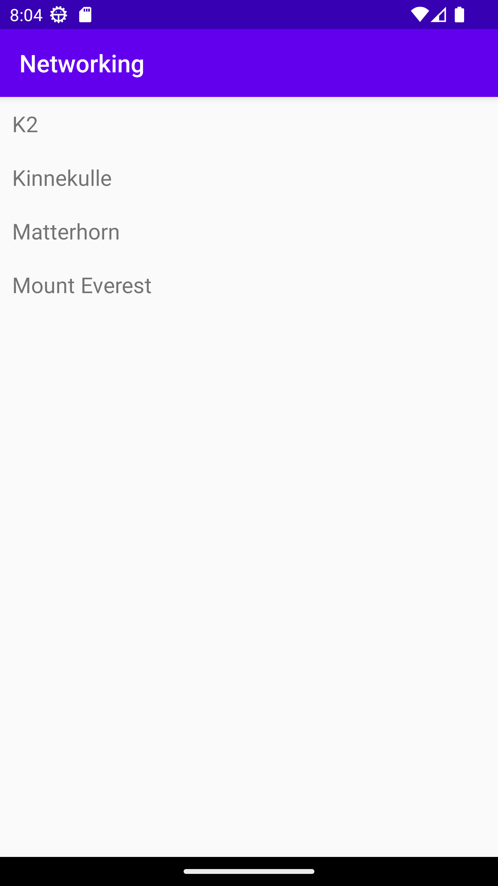

#Rapport

Det första som gjordes var att skapa Mountains klassen. 
Klassen har tre variabler för bergets namn, ID, och höjd. Varje variabel har sin 
egna get och set gör att hämta eller ändra en viss variabel. Den har också en egen 
toString() funktion för att på ett snyggare sätt skriva ut datan för ett vissa berg.

Efter det så används lite gson för att hämta JSON data och göra om det till en 
lista med Mountains objekt. 

När data kunde användas så skapades en RecyclerView i acitivty_main och en 
ny klass skapades för att ha ett RecyclerViewItem. Det består endast av en
TextView. RecyclerViewAdapter klassen kopierades in från canvas. Ändrades lite
för att passa med egna klassnamn, id:S, etc. Från det så skapades en 
RecyclerViewAdapter och en LayoutManager i MainActivity.

När allt det var på plats så kunde datan läggas i RecyclerViewn vilket visas i 
Kod 1. En lista (ArrayList) skapas med typen RecyclerItem och för varje element 
i listOfMountains så skapas ett item i RecyclerViewn. listOfMountains är en lista
som innehåller alla bergen från JSON datan.

```
Type type = new TypeToken<List<Mountains>>() {}.getType();
List<Mountains> listOfMountains = gson.fromJson(json, type);

ArrayList<RecyclerItem> items = new ArrayList<>();
for (Mountains m : listOfMountains) {    
    items.add(new RecyclerItem(m.getName()));
}
```
Kod 1: kod för att lägga in items i recyclerview

Allra sist så behövdes RecyclerViewn puttas ned med margin eftersom det 
första resultatet gömdes av bannern. Slutresultatet visas i Bild 1.


Bild 1: bild på appen